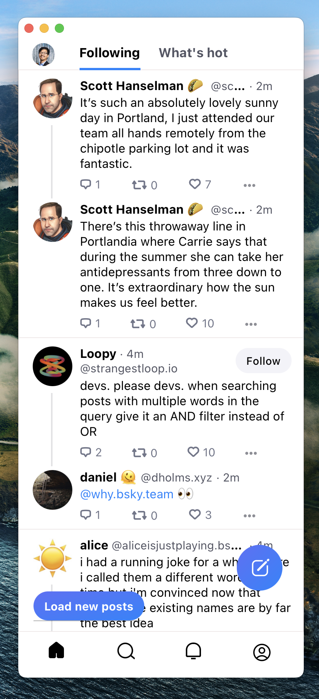

# Sky.app

A lightweight wrapper around bsky.social (staging.bsky.social) on MacOS.

## Download

Clone the repo or download the DMG from the [Releases](https://github.com/jcsalterego/Sky/releases) page.

## Keyboard Shortcuts

* `⌘-N` New Post
* `⌘-1` Home
* `⌘-2` Search
* `⌘-3` Notifications
* `⌘-4` Profile

## Screenshot

## Credits

App icon based on the [work](https://unsplash.com/photos/KVVpx8M10OY) of Carmine Savarese].

## Changelog

### 0.0.3

* Full Light/Dark Mode sync (scrollbars included)

### 0.0.2

* Title bar follows dark mode
* FIX: Remove outer scrollbars

### 0.0.1

* Initial release

## LICENSE

[2-Clause BSD](LICENSE)
